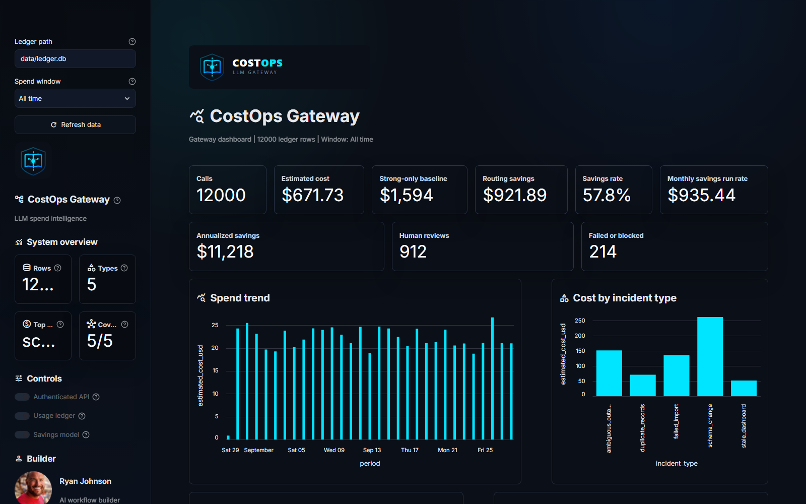
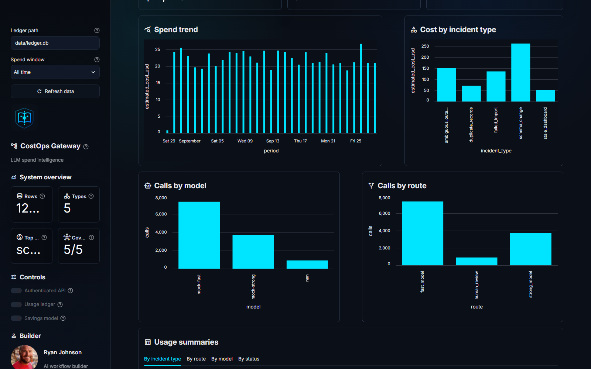

<p align="center">
  
</p>

# LLM Cost and Evaluation Gateway

Repository: https://github.com/rmckayjohnson2021/llm-cost-eval-gateway

## Overview

LLM Cost and Evaluation Gateway is a reusable execution layer for AI applications. It centralizes model calls, records usage, enforces budgets before provider calls, applies routing rules, handles bounded retries, and supports evaluation across model configurations. All cost fields are estimated USD values based on the local pricing table.

This project demonstrates the operational layer needed to run AI workflows with cost control, measurable quality, and explainable routing decisions.

## Business Value Snapshot

The included projected ledger models a synthetic month of `12,000` RunbookOps-style incident triage requests. It compares routed execution against a blind strong-model-only strategy so the dashboard can show the financial impact of model optimization.

| Metric | Projected Monthly Value |
| --- | ---: |
| Routed estimated cost | `$671.73` |
| Strong-only baseline | `$1,593.62` |
| Estimated routing savings | `$921.89` |
| Savings rate | `57.8%` |
| Highest-cost incident type | `schema_change` |

The goal is not to claim provider billing accuracy. The goal is to show how a gateway can make LLM spend observable, attributable, and optimizable before teams scale usage across workflows.

## Project Status

This repo is a working version 1 gateway with mock-provider execution, optional OpenAI-backed execution, configuration-driven routing policies, API-key protected local endpoints, budget reservation, retry handling, SQLite usage logging, a usage dashboard, projected ledger seeding, and runnable demo reports. It is designed to become the companion execution layer for RunbookOps AI.

## Why This Exists

AI applications often start by calling a model directly from the product workflow. That works for prototypes, but teams quickly need shared controls around model choice, cost exposure, retries, evaluation, and auditability. This gateway demonstrates those controls as a reusable layer.

## What It Does

- Provides one central executor for model calls.
- Records usage and execution attempts in SQLite.
- Estimates cost using versioned pricing.
- Reserves budget before provider calls.
- Blocks over-budget requests before inference.
- Applies configurable route policies.
- Handles timeouts and bounded retries.
- Supports mock-provider tests without paid API calls.
- Supports optional OpenAI provider mode when explicitly configured.
- Compares strong-only, fast-only, and routed configurations.
- Tracks estimated routing savings against a strong-only baseline.
- Slices cost, route, model, and status by incident type.
- Provides a Streamlit usage dashboard for local cost analysis.

## Fast Demo Path

1. Seed projected usage rows to demonstrate the dashboard without API spend.
2. Run the Streamlit dashboard.
3. Review projected monthly savings, annualized savings, and spend by incident type.
4. Run the gateway demo to compare `fast_only`, `strong_only`, and `routed` behavior.
5. Run the tests to confirm budget, retry, routing, API, dashboard, and ledger behavior.

```powershell
C:\Users\rmcka\.local\bin\uv.exe run python examples\seed_projected_ledger.py
C:\Users\rmcka\.local\bin\uv.exe run streamlit run dashboard_app.py --server.port 8502
```

Then open `http://127.0.0.1:8502`.

You can still run the smaller policy comparison demo:

```powershell
uv run python examples/run_gateway_demo.py
```

Demo output:

- Report: [`reports/gateway_demo_report.md`](reports/gateway_demo_report.md)
- Ledger summary: [`reports/ledger_summary_report.md`](reports/ledger_summary_report.md)
- Projected ledger summary: [`reports/projected_ledger_summary.md`](reports/projected_ledger_summary.md)
- Ledger: `reports/gateway_demo_ledger.db` local generated file, ignored by Git

## Dashboard Highlights

The dashboard is designed to answer the practical questions teams ask when LLM usage starts growing:

| Question | Dashboard View |
| --- | --- |
| How much did routed execution cost? | Estimated cost KPI |
| What would blind strong-model usage have cost? | Strong-only baseline KPI |
| How much did routing save? | Routing savings, savings rate, monthly run rate, annualized savings |
| Which incident types drive the most cost? | Cost by incident type chart and summary table |
| Which models and routes are being used? | Calls by model and calls by route charts |
| Can the raw audit trail be inspected? | Raw usage ledger table |

## Screenshots

| CostOps dashboard overview | Cost drivers and routing mix |
| --- | --- |
|  |  |

To refresh screenshots while the dashboard is running locally:

```powershell
$env:EDGE_PATH = "C:\Program Files (x86)\Microsoft\Edge\Application\msedge.exe"
node scripts\capture_dashboard_screenshots.js
```

## Architecture Decisions

| Decision | Reason |
| --- | --- |
| Central executor | Keeps product workflows from calling providers directly |
| Pre-call budget reservation | Blocks over-budget requests before inference spend |
| Budget commit/release | Prevents failed calls from leaving stale reservations |
| YAML routing policies | Lets teams tune model choice without changing app code |
| SQLite usage ledger | Provides local auditability without cloud services |
| Markdown ledger summaries | Turns stored usage rows into reviewer-friendly cost and routing reports |
| Streamlit dashboard | Makes spend, savings, and incident-type cost drivers visible |
| Projected ledger seed | Demonstrates dashboard behavior without paid model cycles |
| Mock provider | Enables repeatable tests without paid API calls |
| Optional OpenAI provider | Allows real provider execution without changing gateway flow |
| Versioned pricing table | Makes cost estimates explainable and reproducible |

## Routing Policies

Routing policies live in [`examples/routing_policies.yaml`](examples/routing_policies.yaml). Each policy names the fast model, strong model, default route, human-review signals, and strong-model signals.

The included policies are:

| Policy | Behavior |
| --- | --- |
| `fast_only` | Sends every automatable request to the lower-cost model |
| `strong_only` | Sends every automatable request to the stronger model |
| `routed` | Sends routine work to fast model, high-impact work to strong model, and ambiguous work to human review |
| `openai_routed` | Uses OpenAI model aliases from `.env` while keeping the same routed behavior |

Application code selects a policy with the request field:

```python
ModelRequest(..., route_policy="routed")
```

That allows teams to compare cost, quality, and risk tradeoffs without rewriting the product workflow.

## Provider Modes

Mock mode is the default and does not make paid API calls:

```ini
GATEWAY_PROVIDER=mock
```

OpenAI mode is opt-in:

```ini
GATEWAY_PROVIDER=openai
OPENAI_API_KEY=your_api_key_here
DEFAULT_FAST_MODEL=gpt-5-mini
DEFAULT_STRONG_MODEL=gpt-5-mini
```

Then use the OpenAI policy alias:

```python
ModelRequest(..., route_policy="openai_routed")
```

The gateway still performs the same routing, budget reservation, retry handling, ledger logging, and reporting. The only change is the provider used for model execution.

Cost estimates are local gateway estimates for budget control and demos. They do not replace provider billing records.

## What It Does Not Do

- It does not include production-grade authentication or authorization.
- It does not provide a full admin billing UI.
- It does not claim provider billing records are replaced by local estimates.
- It does not require cloud deployment.

## Tech Stack

- Python
- FastAPI
- Streamlit
- Pydantic
- SQLite
- OpenAI SDK
- pytest
- Ruff
- YAML configuration

## Project Structure

```text
llm-cost-eval-gateway/
  gateway/
    schemas.py
    providers.py
    executor.py
    budgets.py
    ledger.py
    pricing.py
    routing.py
    retries.py
    evaluation.py
    errors.py
  examples/
    routing_policies.yaml
    run_gateway_demo.py
    seed_projected_ledger.py
  dashboard_app.py
  reports/
  tests/
```

## Setup

```powershell
uv sync
Copy-Item .env.example .env
```

Edit `.env` and add local values. Do not commit `.env`.

## Run Tests

```powershell
uv run pytest
uv run ruff check .
```

## Run Demo Report

```powershell
uv run python examples/run_gateway_demo.py
```

The demo executes three representative requests under three routing policies:

- `fast_only`
- `strong_only`
- `routed`

It writes a policy comparison report, a ledger summary report, and a local SQLite ledger so the cost, routing, and audit trail are visible.

## Run Projected Ledger Dashboard

To demonstrate spend analytics without invoking real providers, seed deterministic projected rows:

```powershell
C:\Users\rmcka\.local\bin\uv.exe run python examples\seed_projected_ledger.py
```

The default seed writes `12,000` realistic projected monthly ledger rows across the five RunbookOps incident types:

- `schema_change`
- `failed_import`
- `stale_dashboard`
- `duplicate_records`
- `ambiguous_outage`

Start the dashboard:

```powershell
C:\Users\rmcka\.local\bin\uv.exe run streamlit run dashboard_app.py --server.port 8502
```

The dashboard shows total estimated spend, strong-only baseline cost, estimated routing savings, savings rate, monthly savings run rate, annualized savings, model/route distribution, spend over time, raw ledger rows, and cost by incident type.

## Run API Server

The gateway also exposes a small HTTP API. `GET /health` is public; `/v1/*` endpoints require an API key header.

Set a local API key:

```ini
GATEWAY_API_KEY=local-dev-key
GATEWAY_LEDGER_PATH=C:\Dev\repos\llm-cost-eval-gateway\reports\runbookops_gateway_ledger.db
```

Start the server:

```powershell
uv run uvicorn gateway.api:app --reload --port 8600
```

When demonstrating the paired RunbookOps app, start the dashboard with the same `GATEWAY_LEDGER_PATH` so API calls and dashboard charts read from one ledger.

Call the API:

```powershell
Invoke-RestMethod `
  -Method Post `
  -Uri http://127.0.0.1:8600/v1/execute `
  -Headers @{ "X-Gateway-API-Key" = "local-dev-key" } `
  -ContentType "application/json" `
  -Body '{"app_name":"demo","workflow_version":"v1","simulated_user_id":"user-1","simulated_team_id":"team-1","input_text":"routine import issue","route_policy":"routed","metadata":{"incident_type":"failed_import"}}'
```

Endpoints:

| Method | Path | Purpose |
| --- | --- | --- |
| `GET` | `/health` | Service health check |
| `POST` | `/v1/execute` | Execute one gateway model request |
| `GET` | `/v1/usage` | Return raw usage ledger rows |
| `GET` | `/v1/usage/summary` | Return grouped usage summary as JSON, including incident-type cost summaries |
| `GET` | `/v1/usage/summary.md` | Return grouped usage summary as Markdown |

## Core Flow

Every request should follow this sequence:

1. Validate request.
2. Select route.
3. Check allowed model policy.
4. Estimate bounded cost.
5. Reserve budget atomically.
6. Call provider.
7. Apply timeout and retry rules.
8. Record usage.
9. Reconcile reserved cost.
10. Return structured response.

## Budget Enforcement

Budget controls are pre-call controls. A request that exceeds the configured budget should be blocked before the provider is called.

Budget behavior should be tested with:

- ordinary successful requests
- over-budget requests
- concurrent requests
- retries
- unknown provider usage
- provider failures

## Evaluation

The gateway should support comparisons across:

- strong-only configuration
- fast-only configuration
- routed configuration

Metrics:

- total cases
- acceptable automated results
- human-review rate
- invalid-output rate
- total estimated cost
- estimated savings versus a strong-only baseline
- cost by incident type
- median latency
- slowest latency
- cost per acceptable automated result

## Companion Project

This gateway is designed to support [`team-ai-incident-triage`](https://github.com/rmckayjohnson2021/team-ai-incident-triage), a Streamlit app that triages synthetic data-pipeline incidents using approved runbooks.

## Limitations

This is a portfolio demonstration. Production use would require:

- provider billing reconciliation
- stronger authentication and authorization
- secure deployment
- monitoring
- incident response procedures
- larger evaluation suites

## Development Note

This project was built by Ryan Johnson with AI-assisted development support from OpenAI Codex. I directed the product goals, architecture, testing, review, and iteration of the implementation. All code, documentation, and outputs were co-developed using Codex. 
